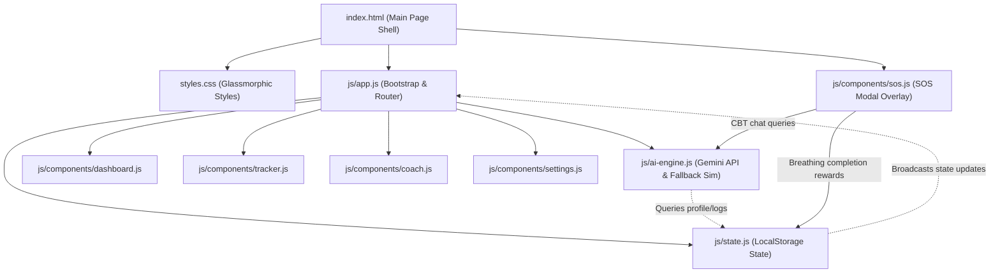
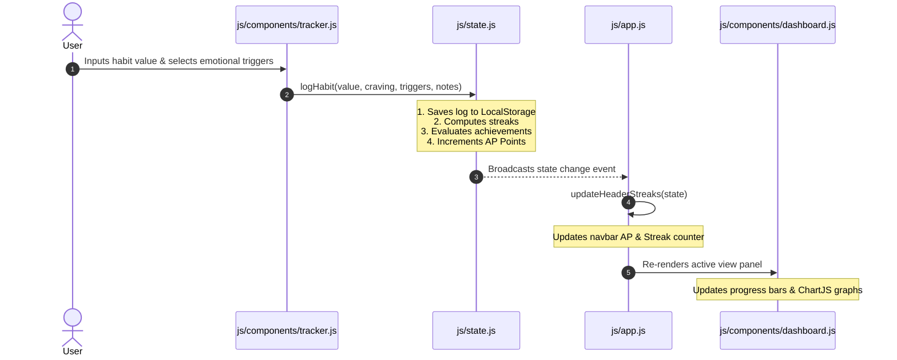
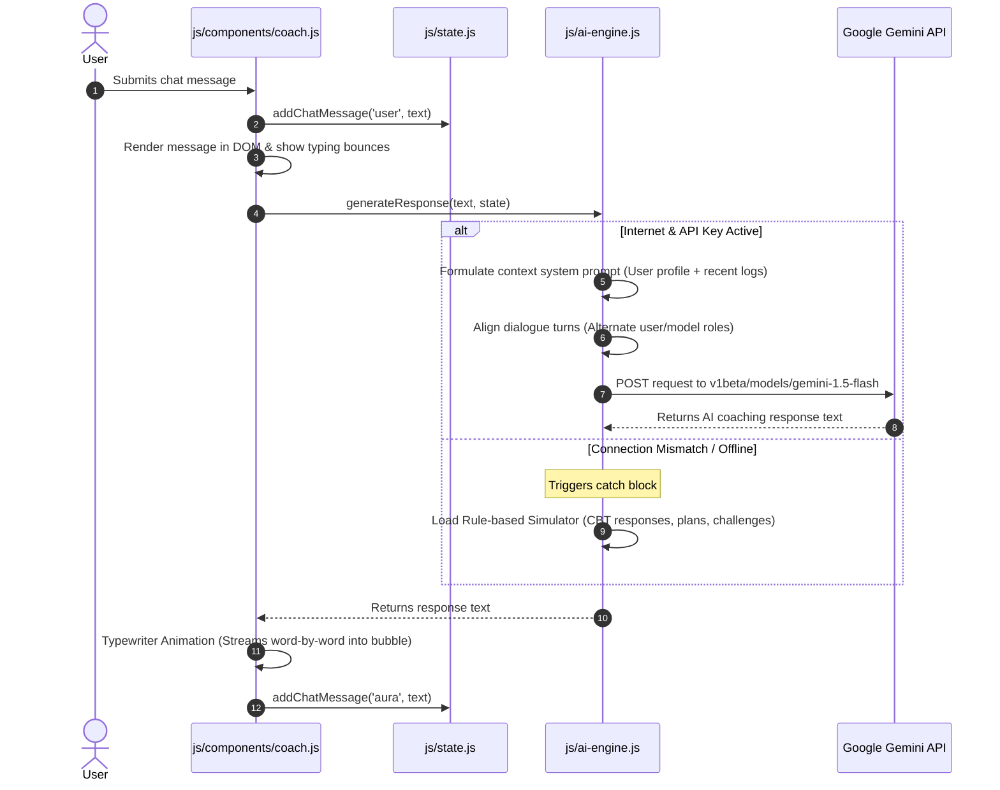

# Aura — Gen-AI Habit Transformation Hub

Aura is a premium, Gen-AI powered web application built to help users overcome digital screen time fatigue and other harmful behavioral habits. It leverages simulated Cognitive Behavioral Therapy (CBT) coaching, trigger logs, daily challenges, and a global **SOS Mode** with an interactive visual breathing pacer to support sustained behavior changes.

---

## 🌟 Key Features
* **AI Coach "Aura"**: Converse with an AI coach that analyzes your habit logs, generates recovery plans, and suggests CBT reframing strategies.
* **Live AI Integration**: Directly integrated with **Google Gemini 1.5 Flash** for personalized feedback using context-aware parameters.
* **Intelligent Nudges**: Context-aware recommendations rendered dynamically on the dashboard based on recent tracking statistics.
* **Habit Tracker & Visual Analytics**: Log metrics (duration, craving intensity, emotional triggers, and reflection notes) and view trends via custom Chart.js graphs.
* **Emergency SOS Modal**: Global de-escalation toolkit featuring a **guided Box Breathing timer** (rewards you with +80 AP on completion), a **Coping Distraction Roulette**, and a distress chat.
* **Gamification & Badges**: Earn Aura Points (AP) and unlock badges (e.g., *Consistency Spark*, *Calm in the Storm*) to celebrate your progress.
* **Fully Responsive**: Sleek, glassmorphic dark-mode interface that adapts beautifully to widescreen monitors, tablets, and smartphones.

---

## 📐 System Architecture

The following diagram illustrates Aura's modular, client-side architecture. It operates as a Single Page Application (SPA) driven by state subscriptions and dynamic view injections.



---

## 🔄 Behavioral Workflows

### 1. Habit Logging and Dynamic Recalculation Flow
When a user logs their metrics, the state engine processes limits, streaks, and achievements, propagating changes back to the interface:



### 2. Context-Aware AI Coach Messaging Flow
When chatting with Aura, the application builds a prompt from historical context and invokes Gemini, falling back to a local model if connectivity fails:



---

## 🚀 How to Run & Host on Any Device

Because Aura has **no build steps and zero npm dependencies**, it is extremely easy to host and run on any device.

### Method 1: Deploy Instantly on GitHub Pages (Highly Recommended)
You can make Aura accessible on your phone, tablet, or any other device by hosting it on GitHub Pages for free:
1. Initialize git in your project directory:
   ```bash
   git init
   git add .
   git commit -m "Initialize Aura app with Gemini API integration"
   ```
2. Create a new repository on GitHub and link it:
   ```bash
   git remote add origin https://github.com/your-username/your-repo-name.git
   git branch -M main
   git push -u origin main
   ```
3. Go to your repository on GitHub.
4. Click on **Settings** (the gear icon at the top).
5. In the left sidebar, click on **Pages**.
6. Under **Build and deployment**, select **Deploy from a branch**.
7. Under **Branch**, select **`main`** (and `/root`), then click **Save**.
8. After a minute, GitHub will give you a live URL (e.g., `https://your-username.github.io/your-repo-name/`) that you can open on any device!

---

### Method 2: Running Locally on Other Devices

Because modern browsers block ES6 Module imports on local file paths (`file://` protocol) due to CORS security rules, you must serve the files using a simple local server:

#### Option A: Using Python (Available on most systems)
Open your terminal in the project directory and run:
```bash
python -m http.server 8000
```
Then navigate to `http://localhost:8000` or `http://<your-computer-ip-address>:8000` on other devices connected to the same Wi-Fi.

#### Option B: Using Node.js / NPX
If you have Node.js installed, run:
```bash
npx http-server -p 8000
```

#### Option C: VS Code Extension
If using VS Code, install the **Live Server** extension, open `index.html`, and click the **Go Live** button in the bottom right status bar.
